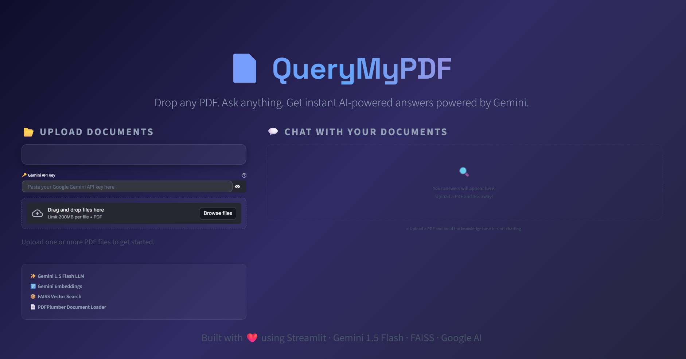

# 📄 QueryMyPDF — AI-Powered Document Assistant

<div align="center">


**Upload any PDF. Ask anything. Get instant, context-aware AI answers.**

[Live Demo](#) · [Report Bug](https://github.com/chaudhary-pawan/querymypdf/issues) · [Request Feature](https://github.com/chaudhary-pawan/querymypdf/issues)

</div>

---

## 🌟 Overview

**QueryMyPDF** is a production-grade, cloud-deployable AI document assistant built on a **Retrieval-Augmented Generation (RAG)** pipeline. It lets users upload PDF files and have rich, intelligent conversations about their content — powered by Google's **Gemini 2.5 Flash** LLM, a **hybrid BM25 + FAISS** retrieval engine, and a **LangGraph** agentic workflow with persistent memory.

The app ships with a fully custom dark-themed Streamlit UI (glassmorphism design, animated bubbles, real-time token streaming) that looks and feels like a modern chat product.

---

## ✨ Features

### 🤖 AI & RAG Pipeline
- **Hybrid Retrieval** — combines **BM25** (keyword/lexical search) and **FAISS** (semantic/vector search) for best-of-both-worlds document retrieval; results are merged and deduplicated so the LLM always gets the most relevant context
- **Gemini 2.5 Flash LLM** — Google's latest fast multimodal model via `langchain-google-genai`
- **HuggingFace Embeddings** — `sentence-transformers/all-MiniLM-L6-v2` for fast, high-quality sentence embeddings (free tier friendly)
- **LangGraph Agentic Loop** — the chatbot is a proper **tool-calling agent** (not a simple chain): it decides *when* to call the RAG tool and can handle conversational turns without unnecessary retrieval
- **Persistent Conversation Memory** — `SqliteSaver` checkpointer persists the full message graph per session, surviving page re-runs

### 📄 Document Handling
- Upload any PDF via the sidebar
- Text extracted page-by-page using `PyPDFLoader`
- Smart chunking with `RecursiveCharacterTextSplitter` (1 500-character chunks, 150-character overlap) — preserves semantic coherence across page boundaries
- Per-session retriever storage keyed by UUID thread ID — multiple users are fully isolated

### 💬 Chat UX
- **Real-time streaming** — tokens appear word-by-word as the model generates them; a blinking cursor shows live generation
- **Stop generation button** — interrupt streaming at any point
- **Graceful error handling** — distinguishes between rate-limit (429), service unavailable (503), and generic errors, surfacing human-readable messages
- Fallback `invoke` path if the stream yields no content
- Clear Chat button to reset conversation while keeping the document loaded
- Document metadata panel shows filename, page count, and chunk count after indexing

### 🎨 UI / Design
- Fully custom CSS dark theme (`#08081a` background, radial violet/indigo gradients)
- Glassmorphism sidebar with `backdrop-filter: blur(24px)`
- Animated chat bubbles — user messages aligned right (purple gradient), AI messages aligned left (frosted glass)
- Animated pulsing dot on the AI label during generation
- Floating empty-state illustrations with CSS `@keyframes` animation
- Responsive layout using Streamlit `wide` mode
- Google Fonts: **Outfit** (headings) + **Inter** (body)

### ⚙️ Performance & Reliability
- **Exponential back-off retry** on embedding calls — handles HuggingFace free-tier 429 / 503 errors automatically (up to 5 retries, starting at 2 s)
- **Batch embedding** — texts are embedded in batches of 50 with a 1-second pause between batches to stay within rate limits
- `@st.cache_resource` on the LLM, embedding model, and compiled graph — these are built exactly once per server process, keeping cold start times low
- SQLite-backed graph checkpointing — no Redis or external service needed

---

## 🏗️ Architecture

```
┌─────────────────────────────────────────────────────┐
│                   Streamlit UI (APP.py)              │
│  Sidebar: PDF Upload → "Build Knowledge Base" btn   │
│  Main: Scrollable chat container + chat_input bar   │
└──────────────────┬──────────────────────────────────┘
                   │ ingest_pdf()
                   ▼
┌─────────────────────────────────────────────────────┐
│               PDF Ingestion Pipeline                 │
│  PyPDFLoader → RecursiveCharacterTextSplitter        │
│     → HuggingFace Embeddings (batch + retry)         │
│     → FAISS vector store  +  BM25 retriever          │
│  Stored in _THREAD_RETRIEVERS[thread_id]             │
└──────────────────────────────────────────────────────┘
                   │ chatbot.stream()
                   ▼
┌─────────────────────────────────────────────────────┐
│              LangGraph Agent (StateGraph)            │
│                                                      │
│   START → [chat_node] ──tools_condition──► [tools]  │
│                ▲                                 │   │
│                └────────────────────────────────┘   │
│                                                      │
│  chat_node: Gemini 2.5 Flash + bound rag_tool        │
│  tool_node: rag_tool → FAISS + BM25 hybrid search   │
│  checkpointer: SqliteSaver (chatbot.db)              │
└──────────────────────────────────────────────────────┘
```

### Data Flow

1. **Upload** — User selects a PDF → bytes streamed to `ingest_pdf()`
2. **Index** — PDF is loaded, split into chunks, embedded, and stored in FAISS + BM25 under the session's `thread_id`
3. **Query** — User types a question → `HumanMessage` fed into the LangGraph agent
4. **Retrieve** — Agent calls `rag_tool(query, thread_id)` → BM25 finds keyword matches, FAISS finds semantic matches → top 8 unique chunks returned as context
5. **Generate** — Gemini 2.5 Flash synthesizes an answer from the retrieved context, streamed token-by-token to the UI
6. **Persist** — Full message history stored in SQLite, survives Streamlit re-runs

---

## 🛠️ Tech Stack

| Layer | Technology | Purpose |
|---|---|---|
| **UI** | Streamlit + Custom CSS | Interactive chat interface |
| **LLM** | Google Gemini 2.5 Flash | Natural language generation |
| **Embeddings** | HuggingFace `all-MiniLM-L6-v2` | Dense vector representations |
| **Vector Store** | FAISS (CPU) | Semantic similarity search |
| **Keyword Search** | BM25 (`rank-bm25`) | Lexical / term-frequency search |
| **Agent Framework** | LangGraph `StateGraph` | Tool-calling agent orchestration |
| **Memory** | LangGraph `SqliteSaver` | Persistent conversation history |
| **PDF Parsing** | LangChain `PyPDFLoader` | Page-level text extraction |
| **Text Splitting** | `RecursiveCharacterTextSplitter` | Semantic chunking |
| **Orchestration** | LangChain Core | Chains, tools, message types |
| **Deployment** | Vercel | Static output / serverless |

---

## 📂 Project Structure

```
QueryMyPDF/
├── APP.py              # Streamlit frontend — UI, state management, streaming
├── RAG_backend.py      # RAG pipeline — ingestion, retrieval, LangGraph agent
├── embed_test.py       # Utility script to test Google GenAI embeddings
├── requirements.txt    # Python dependencies
├── vercel.json         # Vercel deployment configuration
├── assets/             # Screenshot images for documentation
│   ├── PDF_loader.png
│   ├── PDF_loader2.png
│   ├── response.png
│   ├── response1.png
│   ├── source_doc.png
│   └── source_doc1.png
└── public/
    └── index.html      # Static landing / redirect page
```

---

## 📸 Screenshots

### 📂 PDF Upload & Indexing
| Upload | Indexing Complete |
|--------|-------------------|
|  |  |

### 💬 AI Chat & Source References
| AI Response | Source Context |
|-------------|----------------|
|  |  |
|  |  |

---

## 🚀 Getting Started

### Prerequisites

- Python 3.10+
- A **Google Gemini API key** — get one free at [aistudio.google.com](https://aistudio.google.com/)
- A **HuggingFace token** (free) — generate one at [huggingface.co/settings/tokens](https://huggingface.co/settings/tokens)

### Installation

**1. Clone the repository**

```bash
git clone https://github.com/chaudhary-pawan/querymypdf.git
cd querymypdf
```

**2. Create and activate a virtual environment**

```bash
python -m venv venv
# macOS / Linux
source venv/bin/activate
# Windows
venv\Scripts\activate
```

**3. Install dependencies**

```bash
pip install -r requirements.txt
```

**4. Configure environment variables**

Create a `.env` file in the project root:

```env
GOOGLE_API_KEY=your_google_gemini_api_key_here
HF_TOKEN=your_huggingface_token_here
```

> **Note:** `GEMINI_API_KEY` is also accepted as an alias for `GOOGLE_API_KEY`.

**5. Run the app**

```bash
streamlit run APP.py
```

Open [http://localhost:8501](http://localhost:8501) in your browser.

---

## 🧑‍💻 Usage

1. **Upload** a PDF using the sidebar file uploader
2. Click **⚡ Build Knowledge Base** to index the document (chunks + embeddings are built)
3. The sidebar shows a green **✔ Active** badge with page and chunk counts
4. **Ask any question** in the chat input bar at the bottom
5. Watch the answer stream in real-time — press **⏸** to stop generation at any time
6. Click **🗑️ Clear Chat** to start a fresh conversation on the same document

---

## 🔑 Environment Variables

| Variable | Required | Description |
|----------|----------|-------------|
| `GOOGLE_API_KEY` | ✅ Yes | Google Gemini API key |
| `GEMINI_API_KEY` | Optional | Alias for `GOOGLE_API_KEY` |
| `HF_TOKEN` | ✅ Yes | HuggingFace API token for embeddings |

---

## 🧠 Key Design Decisions

### Why Hybrid Retrieval (BM25 + FAISS)?
Pure vector search can miss exact keyword matches (e.g., specific names, codes, dates). Pure BM25 misses semantic similarity. Combining both and deduplicating gives consistently better recall across document types.

### Why LangGraph over a simple chain?
LangGraph models the chatbot as a **stateful agent** with conditional edges. The LLM decides whether retrieval is necessary — avoiding unnecessary API calls on greetings or follow-up clarifications, and allowing the architecture to scale to additional tools (web search, calculator, etc.) without refactoring.

### Why SQLite for memory?
Zero-dependency persistence. The `SqliteSaver` checkpointer stores the full message graph per `thread_id`, meaning conversation context survives Streamlit widget re-runs without any external infrastructure.

### Why batch embedding with exponential back-off?
HuggingFace Inference API free tier enforces strict rate limits. Batching (50 texts/batch) and backing off on 429/503 responses makes the app reliable without requiring a paid plan.

---

## 📦 Dependencies

```
streamlit                    # Web UI framework
langchain>=0.3               # LLM orchestration
langchain-core>=0.3          # Core abstractions
langchain-community>=0.3     # FAISS, BM25, PyPDFLoader
langchain-text-splitters>=0.3
langchain-google-genai>=2.0  # Gemini LLM integration
langchain-huggingface>=0.1   # HuggingFace embeddings
langgraph                    # Agentic state graph
langgraph-checkpoint-sqlite  # SQLite memory checkpointer
faiss-cpu                    # Vector similarity search
rank-bm25                    # BM25 keyword retrieval
pypdf                        # PDF parsing
python-dotenv                # .env file support
requests                     # HTTP utilities
google-genai                 # Google GenAI SDK
```

---

## 🤝 Contributing

Contributions are welcome! Please open an issue first to discuss what you'd like to change.

1. Fork the repository
2. Create a feature branch (`git checkout -b feature/amazing-feature`)
3. Commit your changes (`git commit -m 'Add amazing feature'`)
4. Push to the branch (`git push origin feature/amazing-feature`)
5. Open a Pull Request

---

## 📄 License

Distributed under the MIT License. See `LICENSE` for more information.

---

## 👤 Author

**Pawan Chaudhary**  
GitHub: [@chaudhary-pawan](https://github.com/chaudhary-pawan)

---

<div align="center">
Made with ❤️ using Streamlit · LangGraph · Gemini · FAISS
</div>
